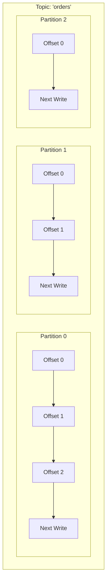
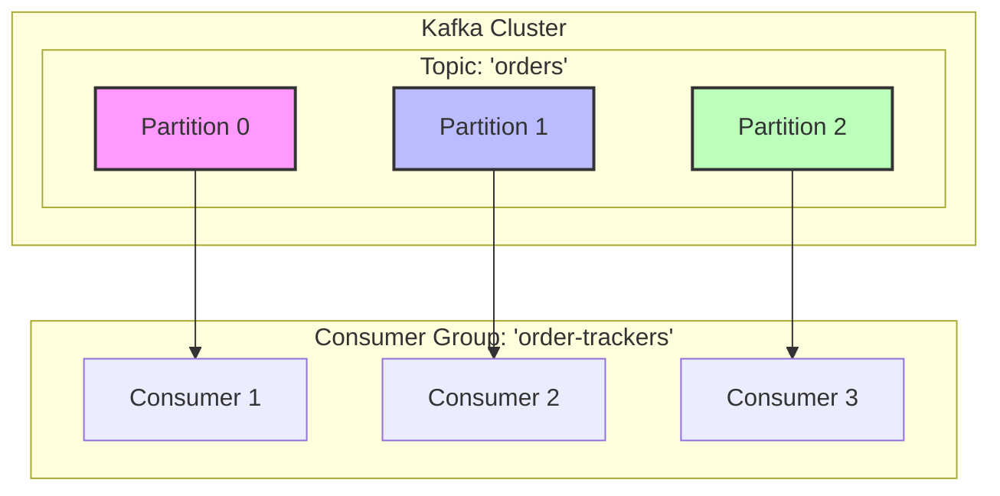
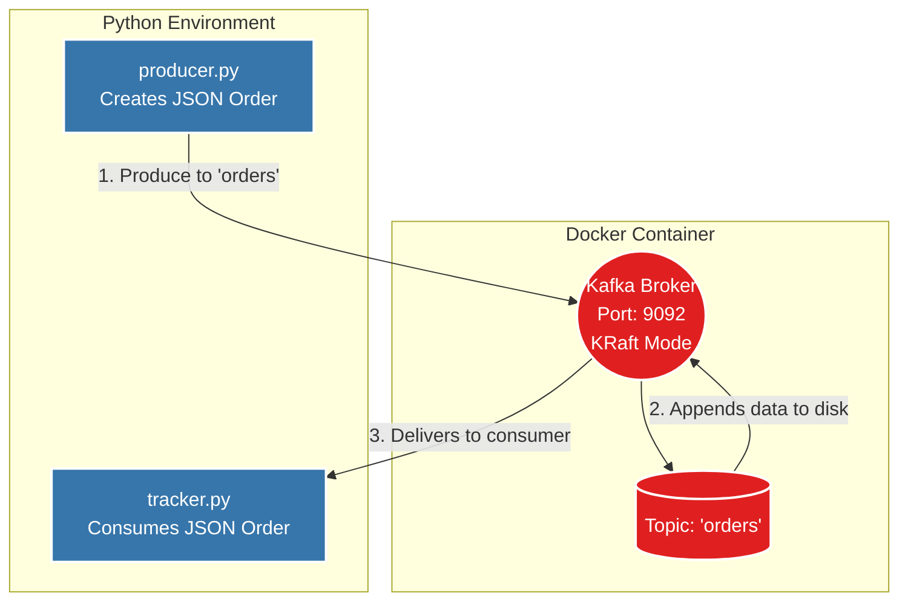

# 🚀 Apache Kafka Guide 


## 📖 Part 1: What is Apache Kafka? 

### 1.1 Overview
At its core, **Apache Kafka** is an open-source **distributed event streaming platform**. 
Instead of databases where you overwrite data, Kafka is an immutable (unchangeable) append-only log of events. It allows you to:
1. **Publish (write)** and **Subscribe to (read)** streams of events continuously.
2. **Store** streams of events durably and reliably for as long as you want.
3. **Process** streams of events as they occur.

Think of it as a highly scalable, fault-tolerant message queue, but unlike traditional message queues (like RabbitMQ) where a message is deleted after being read, Kafka stores it for a configurable amount of time, allowing multiple applications to read the same data at different times.

### 1.2 Key Features of Kafka
- **High Throughput**: Capable of handling millions of messages per second with very low latency (often <10ms).
- **Scalable**: You can add more Kafka servers (Brokers) to a cluster seamlessly without downtime.
- **Permanent Storage/Durability**: Messages are written to disk and replicated across multiple servers to prevent data loss.
- **Fault Tolerant**: If a server crashes, Kafka automatically switches to another server that has a copy of the data.
- **Decoupled Architecture**: The systems sending data (Producers) don't need to know anything about the systems receiving data (Consumers). **In simple words (as seen in this project)**: The checkout system (`producer.py`) just drops the order into Kafka and immediately tells the user "Order Placed!", without waiting for the backend. The backend fulfillment system (`tracker.py`) picks it up independently. If the backend server is slow or crashes, the checkout system still works perfectly because they are "decoupled" (completely separated).

### 1.3 Real-World Use Cases
- **Activity Tracking**: Tracking user clicks, page views, and searches on a website in real-time (e.g., LinkedIn tracking your feed interactions).
- **Log Aggregation**: Collecting log files from thousands of microservices into one centralized location for monitoring and analysis.
- **Microservices Communication**: Acting as the reliable middleman between different backend applications (e.g., an Order Service tells the Shipping Service an order was placed).
- **Real-Time Analytics / Stream Processing**: Analyzing financial fraud, IoT sensor data, or live stock market feeds streams on the fly.
- **Database Spanning (Change Data Capture)**: Syncing data from a main SQL database to a search engine like Elasticsearch in real-time.

---

## 🧠 Part 2: Core Concepts & Terminologies

To understand Kafka, you must understand its vocabulary.

### 2.1 The Event (or Message)
An **Event** (or Message) is a record of "something that happened." 
It usually consists of:
- **Key** (Optional): Used for routing the event to a specific partition.
- **Value**: The actual data payloads (e.g., JSON, String, Avro).
- **Timestamp**: When the event occurred.
- **Headers** (Optional): Metadata.

### 2.2 Topics
A **Topic** is a category or feed name to which events are published. 
- Think of it like a folder in a filesystem, or a table in a database.
- Topics are **multi-subscriber**; a single topic can have zero, one, or many consumers subscribing to it.
- E.g., `orders`, `user-logins`, `payment-transactions`.

### 2.3 Partitions & Offsets
Topics are split into **Partitions**. 
- A partition is a single, ordered sequence of events.
- **Why partition?** Because a single topic might receive more data than one server can handle. Splitting it allows Kafka to distribute the load across multiple servers.
- Each event within a partition gets a sequential ID number called an **Offset**. 
- **Offsets are absolute within a partition.** You cannot change them, and data is only appended to the end.



### 2.4 Brokers and Clusters
- **Broker**: A single Kafka server. It receives messages, assigns offsets, and commits them to disk.
- **Cluster**: A group of Brokers working together. 
- You connect to one Broker (called the Bootstrap Server), and it gives your client the metadata to connect to the entire cluster.

### 2.5 Producers
**Producers** are applications that write data into Kafka topics.
- The Producer automatically knows which Broker and Partition to write to.
- If a message has no Key, Kafka sends it round-robin (evenly distributed) across all partitions.
- If a message has a Key (e.g., `user_id=123`), Kafka hashes the key so all messages for `user_id=123` always go to the exact same partition. This guarantees the chronological ordering of messages for that specific key.

### 2.6 Consumers & Consumer Groups
**Consumers** read data from Kafka topics. 
- They read data in order **within a partition**.
- **Consumer Group**: A group of consumers reading a topic as a team. 
- Kafka ensures that each partition is only read by **one consumer within a group**. This is how Kafka scales reading. If you have 3 partitions and 3 consumers in a group, each reads one partition. 


*(If you add a 4th consumer to the group above, it will sit idle because there are no more partitions available.)*

### 2.7 Replication Factor & Leaders
Kafka replicates (copies) data across multiple Brokers so if one Broker dies, no data is lost.
- **Replication Factor = 3**: Means 1 original copy, and 2 backups.
- **Leader Partition**: For a given partition, exactly ONE broker is the Leader. All producers write to the Leader, and all consumers read from the Leader.
- **ISR (In-Sync Replicas)**: The backups (Followers) fetch data from the Leader. If the Leader crashes, an ISR automatically kicks in and becomes the new Leader.

### 2.8 Zookeeper vs. KRaft
Older Kafka versions required a separate software called **Zookeeper** to manage cluster metadata, leader elections, and broker health.
Modern Kafka relies on **KRaft (Kafka Raft)**. KRaft moves the metadata management directly inside Kafka itself, making it faster, more scalable, and removing the heavy maintenance burden of running Zookeeper.

---

## 🛠️ Part 3: StreamStore Project Deep Dive

In this specific Python project, we are running a complete Kafka environment using Docker, a Python Producer script, and a Python Consumer script.

### 3.1 Project Architecture Flowchart



---

## 🐳 3.2 The Infrastructure: `docker-compose.yaml` Explained

This file brings our Kafka Broker to life using Docker in KRaft mode.

```yaml
version: '3.8'

services:
  kafka:
    image: confluentinc/cp-kafka:latest # Pulls the official Kafka image from Confluent
    container_name: kafka # Easy name to reference this docker container
    ports:
      - "9092:9092" # External Python clients will connect to localhost:9092

    environment:
      KAFKA_KRAFT_MODE: 'true' # Tells Kafka NOT to look for Zookeeper, use KRaft instead.

      CLUSTER_ID: '1L6g7nGhU-eAKfL--X25wo' # A static, unique identifier string for the cluster
      KAFKA_NODE_ID: 1 # Identity of this specific server node

      # Roles assigning: this single node will act as both a data broker AND a cluster controller.
      KAFKA_PROCESS_ROLES: broker,controller 
      
      # Who votes for the leader? Node 1, connecting internally at 9093.
      KAFKA_CONTROLLER_QUORUM_VOTERS: 1@kafka:9093 
      
      # Kafka's internal topic used to track consumer offsets (what messages have been read). 
      # Since we have only 1 broker, this must be 1. Default in prod is 3.
      KAFKA_OFFSETS_TOPIC_REPLICATION_FACTOR: 1 

      # Networking map: 
      # - PLAINTEXT for client communication on port 9092.
      # - CONTROLLER for internal broker-to-broker communication on port 9093.
      KAFKA_LISTENERS: PLAINTEXT://0.0.0.0:9092,CONTROLLER://0.0.0.0:9093
      
      # When a client hits 9092, Kafka returns this address to the client saying "Send data here"
      KAFKA_ADVERTISED_LISTENERS: PLAINTEXT://localhost:9092 
      
      # Specifies which listener is used for controller tasks
      KAFKA_CONTROLLER_LISTENER_NAMES: CONTROLLER 

      # Directory inside the container where the raw physical data files will be written
      KAFKA_LOG_DIRS: /tmp/kraft-combined-logs 

    volumes:
      - kafka_kraft:/var/lib/kafka/data # Persists the Kafka data even if the container stops.

volumes:
  kafka_kraft:
```

---

## 📤 3.3 The Producer Code: `producer.py` Explained

The Producer creates an order and pushes it to Kafka. We use the `confluent_kafka` library in Python.

**1. Import Dependencies**
```python
import json
import uuid
from confluent_kafka import Producer
```
- `uuid`: Used to generate a 100% unique alphanumeric ID for our orders.
- `confluent_kafka.Producer`: The C-optimized Python class that handles Kafka connections.

**2. Configure and Initialize the Producer**
```python
producer_config = {
    "bootstrap.servers": "localhost:9092"
}
producer = Producer(producer_config)
```
- `bootstrap.servers`: Provides the entry point. The producer contacts `localhost:9092`, and Kafka responds with all the metadata it needs.

**3. Define the Delivery Callback Function**
```python
def delivery_report(err, msg):
    if err:
        print(f"❌ Delivery failed: {err}")
    else:
        print(f"✅ Delivered {msg.value().decode('utf-8')}")
        print(f"✅ Delivered to {msg.topic()} : partition {msg.partition()} : at offset {msg.offset()}")
```
- Kafka produces messages **asynchronously**. It doesn't block the Python script. When Kafka finally acknowledges it received and saved the message (or if it failed), it immediately triggers this `delivery_report` function to let us know the exact Topic, Partition, and Offset assigned.

**4. Create Data and Serialize**
```python
order = {
    "order_id": str(uuid.uuid4()),
    "user": "lara",
    "item": "frozen yogurt",
    "quantity": 10
}
value = json.dumps(order).encode("utf-8")
```
- `json.dumps`: Turns the Python dictionary into a JSON formatted string.
- `.encode("utf-8")`: Kafka does not know what JSON or Strings are. It strictly stores **bytes**. We encode the string into a byte stream.

**5. Send to Kafka (Produce)**
```python
producer.produce(
    topic="orders",
    value=value,
    callback=delivery_report
)
producer.flush()
```
- `topic="orders"`: Maps the destination. If the topic doesn't exist, Kafka (by default) will auto-create it.
- `producer.flush()`: Forces Python to wait. Because `.produce()` is asynchronous, if we don't call `.flush()`, the script will reach the end and terminate *before* the message actually gets sent over the network.

---

## 📥 3.4 The Consumer Code: `tracker.py` Explained

The Consumer connects to the cluster and starts aggressively asking (polling) if there is any new data on the `"orders"` topic.

**1. Configure the Consumer**
```python
from confluent_kafka import Consumer

consumer_config = {
    "bootstrap.servers": "localhost:9092",
    "group.id": "order-tracker",
    "auto.offset.reset": "earliest"
}
consumer = Consumer(consumer_config)
```
- `group.id`: Defines the Consumer Group. Kafka tracks which messages have been read by remembering the offset for `"order-tracker"`. If you stop the script and start it tomorrow, it will pick up exactly where it left off!
- `auto.offset.reset: earliest`: If `"order-tracker"` has never connected before, should it read all old data from the beginning of time (`earliest`) or only read new data created from this second forward (`latest`)? We chose to read everything.

**2. Subscription and Polling Loop**
```python
consumer.subscribe(["orders"])

try:
    while True:
        msg = consumer.poll(1.0)
```
- `.subscribe()`: Binds the consumer to the topic.
- `while True`: Streaming is endless. We loop forever.
- `.poll(1.0)`: Reaches out to Kafka to ask for data. Wait for `1.0` seconds max. If no data, return `None`.

**3. Error Handling and Deserialization**
```python
        if msg is None:
            continue
        if msg.error():
            print("❌ Error:", msg.error())
            continue

        value = msg.value().decode("utf-8")
        order = json.loads(value)
        print(f"📦 Received order: {order['quantity']} x {order['item']} from {order['user']}")
```
- If `msg` has data, we reverse the producer's process: Decode bytes -> string, then parse string (`json.loads`) -> Python dictionary. We then print it out in real-time.

**4. Graceful Shutdown**
```python
except KeyboardInterrupt:
    print("\n🔴 Stopping consumer")
finally:
    consumer.close()
```
- If we hit `CTRL+C`, Python stops the script.
- `consumer.close()` is extremely important. It tells Kafka "I am leaving the group." Kafka will then reassign this consumer's partitions to remaining active consumers in the group immediately, preventing data reading delays.

---

## � Part 5: Comprehensive CLI Commands

You can run these commands from your local machine, inside the docker container, to interact with Kafka manually.

### 5.1 Topic Operations
List all topics in the cluster:
```bash
docker exec -it kafka kafka-topics --list --bootstrap-server localhost:9092
```

Create a new topic with custom partitions:
```bash
docker exec -it kafka kafka-topics --create --topic new_orders --partitions 3 --replication-factor 1 --bootstrap-server localhost:9092
```

Inspect a topic (Shows Partition Leader, Replicas, and In-Sync Replicas):
```bash
docker exec -it kafka kafka-topics --describe --topic orders --bootstrap-server localhost:9092
```

Delete a topic:
```bash
docker exec -it kafka kafka-topics --delete --topic new_orders --bootstrap-server localhost:9092
```

### 5.2 Console Producers & Consumers
If you don't want to use Python, you can send and receive messages straight through the terminal!

Produce messages (type in the terminal, hit enter to send):
```bash
docker exec -it kafka kafka-console-producer --topic orders --bootstrap-server localhost:9092
```

Consume messages from the beginning:
```bash
docker exec -it kafka kafka-console-consumer --topic orders --from-beginning --bootstrap-server localhost:9092
```

### 5.3 Consumer Groups Management
List all active consumer groups:
```bash
docker exec -it kafka kafka-consumer-groups --list --bootstrap-server localhost:9092
```

Check the "Lag" of a consumer group (Lag is how far behind the consumer is from the producer. If Lag is climbing, your consumer is too slow!):
```bash
docker exec -it kafka kafka-consumer-groups --describe --group order-tracker --bootstrap-server localhost:9092
```

---

## 🚀 Part 6: Advanced Kafka Ecosystem (Beyond the Basics)
As you grow with Kafka, you will encounter the broader ecosystem:

1. **Kafka Connect**: A tool to stream data between Kafka and other systems (like databases, Elasticsearch, S3) using configuration files *without writing any code*.
2. **Kafka Streams & ksqlDB**: Tools to process, aggregate, join, and filter data in real-time natively inside Kafka. E.g., "Calculate the total revenue generated every 5 minutes."
3. **Schema Registry**: Enforces data structures. Instead of relying on Python's JSON module, you define strict contracts (like Avro or Protobuf). If a Producer sends a bad schema, Schema Registry blocks it to prevent downstream consumers from crashing.
4. **Exactly-Once Semantics (EOS)**: Advanced configuration ensuring that even if there is a network glitch and a Producer accidentally sends a message twice, it is only recorded and processed exactly once.

